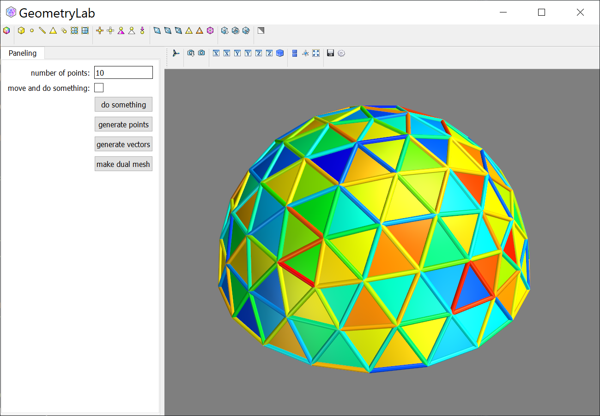

# geometrylab
python + mayavi codebase for visualizing optimization problem in Geometry Processing / Archtectural Geometry


This project was initially developed by [Davide Pellis (davidepellis@gmail.com)](https://scholar.google.com/citations?user=JnocFM4AAAAJ&hl=en).


## Instructions to set up a working environment in Windows / MacOS

Using Anaconda to install every package.

    1. Download Anaconda

    2. Open Anaconda Prompt
    ```
    $ conda create -n geo 
    $ conda activate geo
    $ conda install mayavi traits traitsui qt pyqt vtk scipy spyder 
    $ conda install -c haasad pypardiso
    ```
    3. Open Anaconda, under "geo" environment open Spyder

Once above installation failed because of versions conflict, then try below installations:

    ```
    $ conda create -n geo python=3.6
    $ conda activate geo
    $ pip install numpy scipy
    $ pip install python-vtk
    $ pip install mayavi --no-cache
    $ conda install -c haasad pypardiso
    $ conda install pyface
    ```

## File tree

<details>
<summary><span style="font-weight: bold;">File tree.</span></summary>
    ```
    📁 geometrylab/
    ├─📁 fitting/
    │ ├─📄 bspline.py
    │ ├─📄 cluster.py
    │ ├─📄 jetfitting.py
    │ ├─📄 linearregression.py
    │ └─📄 __init__.py
    ├─📁 geometry/
    │ ├─📄 bspline.py
    │ ├─📄 circle.py
    │ ├─📄 frame.py
    │ ├─📄 meshprimitives.py
    │ ├─📄 meshpy.py
    │ ├─📄 meshutilities.py
    │ ├─📄 points.py
    │ ├─📄 polyline.py
    │ └─📄 __init__.py
    ├─📁 gui/
    │ ├─📄 geolabcomponent.py
    │ ├─📄 geolabgui.py
    │ ├─📄 geolabmesh.py
    │ ├─📄 geolabpoints.py
    │ ├─📄 geolabscene.py
    │ ├─📄 handler.py
    │ ├─📁 img/
    │ ├─📄 multiscenemanager.py
    │ ├─📄 scenemanager.py
    │ ├─📄 tools.py
    │ └─📄 __init__.py
    ├─📄 LICENSE
    ├─📁 optimization/
    │ ├─📄 combnormals.py
    │ ├─📄 gridshell.py
    │ ├─📄 guidedprojection.py
    │ ├─📄 guidedprojectionbase.py
    │ └─📄 __init__.py
    ├─📄 README.md
    ├─📁 test/
    │ ├─📄 GUI.png
    │ ├─📄 paneling.py
    │ ├─📄 quad_dome.obj
    │ ├─📄 tri_dome.obj
    │ └─📄 tri_mesh.obj
    ├─📁 utilities/
    │ ├─📄 utilities.py
    │ └─📄 __init__.py
    ├─📁 vtkplot/
    │ ├─📄 bsplineplotmanager.py
    │ ├─📄 check.py
    │ ├─📄 edgesource.py
    │ ├─📄 facesource.py
    │ ├─📄 glyphs.py
    │ ├─📄 glyphsource.py
    │ ├─📄 meshplotmanager.py
    │ ├─📄 meshvectorsource.py
    │ ├─📄 plotmanager.py
    │ ├─📄 plotutilities.py
    │ ├─📄 pointsource.py
    │ ├─📄 pointsplotmanager.py
    │ ├─📄 polylinesource.py
    │ ├─📄 scenemanager.py
    │ ├─📄 selector.py
    │ ├─📄 toolbar.py
    │ ├─📄 vector3dsource.py
    │ ├─📄 vectorsource.py
    │ ├─📄 viewer.py
    │ └─📄 __init__.py
    └─📄 __init__.py
    ```
</details>
<br>


## Open the GUI 

If you want to test how it works, just try python files in geometrylab/test: ex. run paneling.py, then a GUI window will be opened.
You can add waterever you like for the settings of optimization and visualization.



More implementation architecture can refer to the [DOS project](https://github.com/WWmore/DOS), which is based on this codebase.

