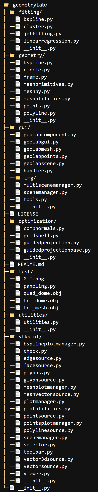

# geometrylab
python + mayavi codebase for visualizing optimization problem in Geometry Processing / Archtectural Geometry


This project was initially developed by [Davide Pellis (davidepellis@gmail.com)](https://scholar.google.com/citations?user=JnocFM4AAAAJ&hl=en).


## Instructions to set up a working environment in Windows / MacOS

Using Anaconda to install every package.

    1. Download Anaconda

    2. Open Anaconda Prompt
    ```
    $ conda create -n geo 
    $ conda activate geo
    $ conda install mayavi traits traitsui qt pyqt vtk scipy spyder 
    $ conda install -c haasad pypardiso
    ```
    3. Open Anaconda, under "geo" environment open Spyder

Once above installation failed because of versions conflict, then try below installations:

    ```
    $ conda create -n geo python=3.6
    $ conda activate geo
    $ pip install numpy scipy
    $ pip install python-vtk
    $ pip install mayavi --no-cache
    $ conda install -c haasad pypardiso
    $ conda install pyface
    ```

## File tree

<details>
<summary><span style="font-weight: bold;">File tree.</span></summary>

  
</details>
<br>


## Open the GUI 

If you want to test how it works, just try python files in geometrylab/test: ex. run paneling.py, then a GUI window will be opened.
You can add waterever you like for the settings of optimization and visualization.


More implementation architecture can refer to the [DOS project](https://github.com/WWmore/DOS), which is based on this codebase.

